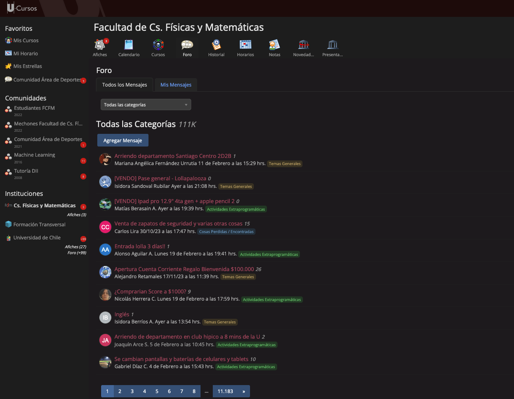

## Personalización CSS para la Universidad 

En este repositorio se irá añadiendo las distintas personalizaciones para los sitios web de la Universidad. Para añadir un 
archivo CSS al navegador basta con utilizar cualquier plugin de los disponibles. En mi caso se está ocupando Mozilla Firefox 
con el plugin llamado *"Stylebot"*. 

### Theme de Ucursos 

Se trató de hacer más oscuro el sitio y que contraste mejor con el rojo. Por el otro lado, reducir al máximo algunas distracciones 
que no tienen mucha utilidad

